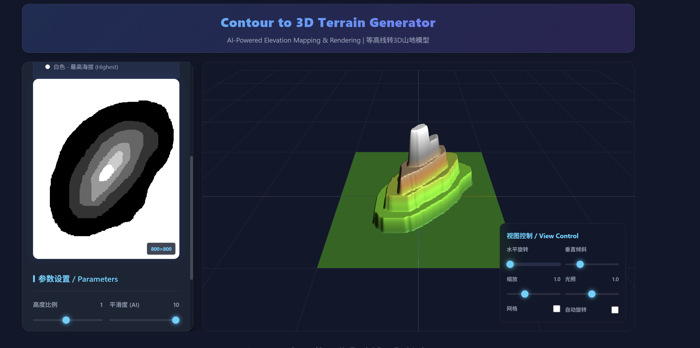
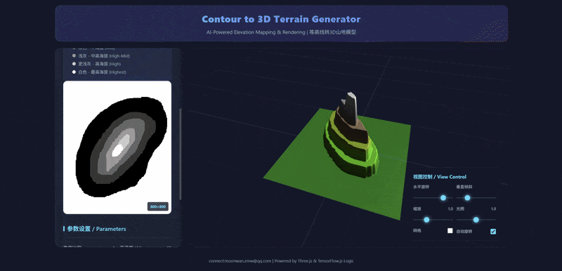

# Contour-to-3D Terrain Generator ⛰️

  

## 🎬 Live Algorithm Demo

  

## 🌟 Overview
This project bridges the gap between 2D geospatial data and 3D visualization. Users can either upload existing contour maps or hand-draw topographic lines, and the application processes these inputs to generate a smooth, navigable 3D mesh in real-time.

## ✨ Key Features
* **Dual Input Mode:** Support for both image uploads and interactive canvas drawing.
* **Real-time 3D Reconstruction:** Instant mesh generation from 2D height data.
* **Advanced Image Processing:** Custom implementations of **Gaussian Blur** for heightmap smoothing and **Bilinear Interpolation** for resolution upscaling.
* **Dynamic Customization:** Adjustable height scale, terrain smoothness, and lighting intensity.
* **Model Export:** Support for exporting generated models as `.obj` files for professional 3D workflows.

## 🛠️ Tech Stack & Algorithms
* **Core Logic:** JavaScript (ES6+)
* **3D Rendering:** [Three.js](https://threejs.org/)
* **Optimization:** [TensorFlow.js](https://www.tensorflow.org/js) for efficient data handling.
* **Core Algorithms:**
    * **Bilinear Interpolation:** Ensures high-resolution meshes even from low-resolution inputs.
    * **Gaussian Kernel Convolution:** Mimics natural geological transitions by smoothing raw contour data.
    * **Height-based Vertex Coloring:** Procedural shading based on elevation levels.

## 📖 How to Use
1. **Input:** Use the "Upload" button for an image or "Draw Mode" to create your own contours.
2. **Generate:** Click "Generate 3D Model" to trigger the processing pipeline.
3. **Adjust:** Use the control panel to tilt, rotate, or scale the terrain.
4. **Export:** Save your creation as an `.obj` file.

## 🔗 Live Demo
[View the Live Project Here](https://mwzz-code.github.io/contour-to-3d/)
